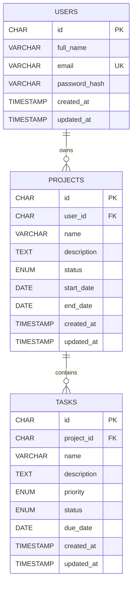

# ER Diagram

A user owns many projects, and a project contains many tasks. Tasks have no `user_id`; ownership is `TASKS -> PROJECTS -> USERS`.

An exported image is in `docs/er-diagram.png`. The full definitions are `docs/schema.sql` and `backend/prisma/schema.prisma`.

## Constraints

| Constraint | Details |
|---|---|
| Primary keys | `CHAR(36)` UUIDs on all three tables |
| Unique | `users.email` |
| Foreign keys | `projects.user_id -> users.id` (`fk_projects_user`), `tasks.project_id -> projects.id` (`fk_tasks_project`) |
| Cascades | `ON DELETE CASCADE` on both foreign keys: deleting a user deletes their projects, deleting a project deletes its tasks |
| Indexes | `idx_projects_user_id`, `idx_tasks_project_id` |
| Timestamps | `created_at` defaults to `CURRENT_TIMESTAMP`; `updated_at` also updates `ON UPDATE CURRENT_TIMESTAMP` |

## Enums

| Column | Values |
|---|---|
| `projects.status` | `NOT_STARTED`, `IN_PROGRESS`, `COMPLETED` |
| `tasks.priority` | `LOW`, `MEDIUM`, `HIGH` |
| `tasks.status` | `PENDING`, `IN_PROGRESS`, `COMPLETED` |
